# ⚖️ CaseLaw Assistant

An AI-powered legal Q&A assistant built on a **Retrieval-Augmented Generation (RAG)** pipeline. Ask legal questions in plain English and receive answers grounded in indexed case law, with the supporting source documents attached to every response.

## Features

- **Hybrid retrieval** — combines dense semantic search (Jina embeddings) with BM25 keyword search via a LangChain `EnsembleRetriever`.
- **Cloud vector store** — backed by [Weaviate Cloud](https://weaviate.io/).
- **OpenAI LLM** — answers generated with OpenAI models (default: `gpt-4o-mini`).
- **Source attribution** — the UI shows the documents that informed each answer.
- **FastAPI backend** with a lightweight chat UI (Jinja2 + vanilla JS).
- **Dockerized** for reproducible deployment.

## Architecture



```
Browser (chat.html)
      │  POST /chat
      ▼
FastAPI (app.py)
      │
      ▼
RAG chain (RetrievalQAWithSourcesChain)
      ├── Hybrid retriever ── Semantic (Jina v3 embeddings) ─┐
      │                       BM25 (rank_bm25)               ├── Weaviate Cloud
      └── LLM (OpenAI)                                       ┘
```

| Module | Responsibility |
| --- | --- |
| `app.py` | FastAPI app, routes (`/`, `/health`, `/chat`), startup/shutdown lifecycle |
| `lawchatbot/config.py` | Typed configuration (`pydantic-settings`) |
| `lawchatbot/weaviate_client.py` | Weaviate Cloud connection |
| `lawchatbot/embedding.py` | Jina embedding wrapper |
| `lawchatbot/vectorstore.py` | LangChain ↔ Weaviate vector store |
| `lawchatbot/retrievers.py` | Semantic, BM25, and hybrid retrievers |
| `lawchatbot/rag_chain.py` | LLM init + RAG chain assembly |

## Prerequisites

- Python 3.11+
- A [Weaviate Cloud](https://console.weaviate.cloud/) cluster with your legal documents indexed
- An [OpenAI](https://platform.openai.com/) API key

## Configuration

All secrets are read from environment variables — **nothing is hardcoded**. Copy the template and fill it in:

```bash
cp .env.example .env
# then edit .env
```

| Variable | Required | Description |
| --- | --- | --- |
| `WEAVIATE_URL` | ✅ | Weaviate Cloud cluster URL |
| `WEAVIATE_API_KEY` | ✅ | Weaviate API key |
| `OPENAI_API_KEY` | ✅ | OpenAI API key |
| `WEAVIATE_CLASS` | — | Collection name (default `JustiaFederalCases`) |
| `OPENAI_MODEL` | — | Model id (default `gpt-4o-mini`) |
| `ALLOWED_ORIGINS` | — | Comma-separated CORS origins (default `*`) |

## Run locally

```bash
python -m venv .venv
source .venv/bin/activate          # Windows: .venv\Scripts\activate
pip install -r requirements.txt
uvicorn app:app --host 0.0.0.0 --port 7860
```

Then open http://localhost:7860.

## Run with Docker

```bash
# Build + run with your .env
docker compose up --build
```

The app listens on port **7860** and exposes a `/health` endpoint used by the container healthcheck.

## API

| Method | Path | Body | Description |
| --- | --- | --- | --- |
| `GET` | `/` | — | Chat web UI |
| `GET` | `/health` | — | Readiness probe |
| `POST` | `/chat` | `{"question": "..."}` | Returns `{"answer": "...", "context": [...]}` |

```bash
curl -X POST http://localhost:7860/chat \
  -H "Content-Type: application/json" \
  -d '{"question": "What is the standard for summary judgment?"}'
```

---

© 2025 Orbologic. CaseLaw Assistant.
